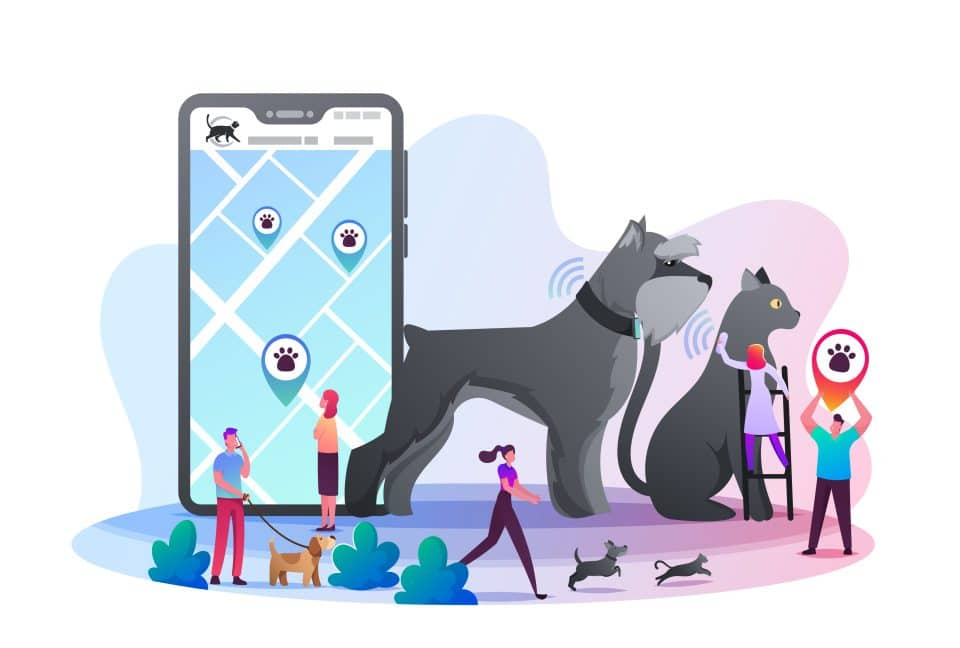

# Concept 

## Introduction 
Pet tracking is an essential aspect of pet ownership, and it can be challenging to keep an eye on pets at all times. This project aims to develop a pet tracking system that utilizes an ESP32 Heltec LoRa v2 and GPS module to track pets' movements. The system allows pet owners to monitor their pets' location, view their pets' movement history, and receive alerts when their pets leave a designated area.

## Features
The pet tracking system has the following features:
- Real-time location tracking: The system utilizes GPS technology to track pets' location in real-time.
- Receiver: The receiver is a device that can receive signals trasmitted by the pet tracker.
- Geofencing: Pet owners can set up a designated area for their pets, and the system will send an alert when the pet leaves the designated area.
- Movement history: The system keeps track of pets' movements and displays the data in a graphical format for pet owners to review.
- Notifications: Pet owners receive notifications via email when their pets leave the designated area.

## Service Details
To use the pet tracking system, pet owners must first attach the ESP32 Heltec LoRa v2 with GPS module to their pet's collar or harness. The system is powered by a battery, and the battery life will depend on how often the system is used. One or more receivers has to be set up in order to listen for messages coming from the pet tracker.

Pet owners can access the system's features through a web interface. The web interface allows pet owners to view their pets' location, movement history, and set up geofencing.

When pet owners set up geofencing, they can define a specific area where their pet is allowed to roam. If the pet leaves the designated area, the system sends an alert to the pet owner's email address. Pet owners can then use the web interface to track their pet's location and retrieve their pet.

## Conclusion
Pet tracking is a crucial aspect of pet ownership, and this pet tracking system using ESP32 Heltec LoRa v2 and GPS module can provide a reliable and efficient solution for pet owners. With real-time location tracking, geofencing, movement history, and notifications, pet owners can keep an eye on their pets' location and ensure their pets' safety.
