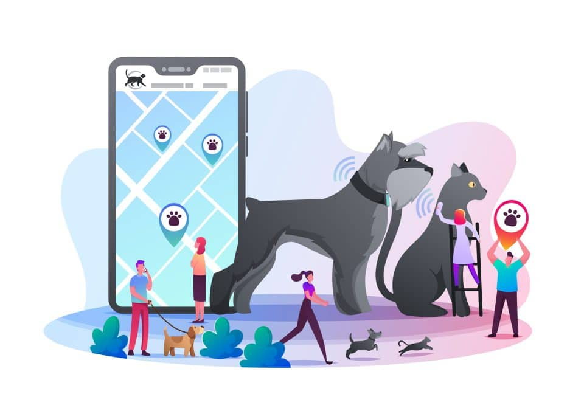

# Concept 

## Introduction 
Pet tracking is an essential aspect of pet ownership, and it can be challenging to keep an eye on pets at all times. This project aims to develop a pet tracking system that utilizes an ESP32 Heltec LoRa v2 and GPS module to track pets' movements. The system allows pet owners to monitor their pets' location, view their pets' movement history, and receive alerts when their pets leave a designated area.

## Features
The pet tracking system has the following features:
- location tracking: The system utilizes GPS technology to track pets' location in real-time.
- Geofencing: Pet owners can set up a designated area for their pets, and the system will send an alert when the pet leaves the designated area.
- Movement history: The system keeps track of pets' movements and displays the data in a graphical format for pet owners to review.
- Notifications: Pet owners receive en email when their pets leave the designated area that incities the owner to access the site.

## Service Details
To use the pet tracking system, pet owners must first attach the ESP32 Heltec LoRa v2 with GPS module to their pet's collar or harness. The system is powered by a battery, and the battery life will depend on the position of the pet, if it is in the geofence the device does not track the animal, on the other hand if the pet is outside the geofence, the device will update the positiono every 5 minutes.

Pet owners can access the system's features through a web interface. The web interface allows pet owners to view their pets' location, movement history, and set up geofencing. The web interface also allow to the user to active a light and a sound signal, in order to make easier find the pet in low-visibility condition.

When pet owners set up geofencing, they can define a specific area where their pet is allowed to roam. If the pet leaves the designated area, the system sends an alert to the pet owner's email address. Pet owners can then use the web interface to track their pet's location and retrieve their pet.

## Conclusion
Pet tracking is a crucial aspect of pet ownership, and this pet tracking system using ESP32 Heltec LoRa v2 and GPS module can provide a reliable and efficient solution for pet owners. With location tracking, geofencing, movement history, and notifications, pet owners can keep an eye on their pets' location and ensure their pets' safety.