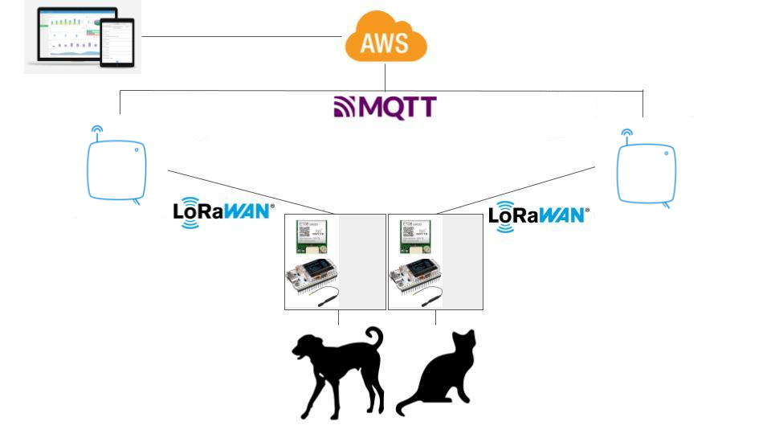

# Design

## Conceptual Architecture
The pet tracking system architecture consists of two main components: an ESP32 v2 Heltec LoRa, with the GPS module. The ESP32 is responsible for collecting location data from the GPS module, processing the data, and sending it to the receivers. Then, the receivers will be responsible for sending the data to AWS cloud service for storage and analysis.

The cloud service is responsible for storing the pet's location data, analyzing the data, and sending alerts to the pet owner when their pet leaves the designated area. The pet owner can access the cloud service through a web interface.

## Hardware Components
ESP32 v2 Heltec LoRa board
The ESP32 v2 Heltec LoRa board is the primary hardware component of the pet tracking system. There are two ESP32 in our system: one is responsible for collecting location data from the GPS module, processing the data, and sending it to the receiver; the other is the receiver itself, that is responsible responsible for sending the data to AWS cloud service. The two modules has a built-in LoRa transceiver that allows them to communicate with each other over long distances.

GPS Module
The GPS module is responsible for getting location data. The module communicates with the ESP32 v2 Heltec LoRa module over a serial connection.

Buzzer
The buzzer is used to emit a loud sound in the case in which the pet owner wants to find his pet and he cannot see it.

LED
The LED is also used to flash in the case in which the pet owner cannot find his pet during the night.

Battery
The battery is responsible for providing energy to the ESP32 board.

## Software Components
Core Algorithms
The pet tracking system uses several core algorithms to function correctly. The algorithms are responsible for collecting location data, processing the data, and sending alerts to the pet owner when their pet leaves the designated area.

Network Protocols
The pet tracking system uses the LoRaWAN protocol to communicate between the ESP32 v2 Heltec LoRa and GPS module and the cloud service. LoRaWAN is a low-power, wide-area network protocol that allows for long-range communication between devices.

## Network Architecture

                +-------------+
                |      DB     |
                +-------------+
                         |
                         |
                         |
             +----------------+
             | Cloud Service  |
             +----------------+
                         |
                         |
                         |
           +-----------------+
           | LoRaWAN Receiver|
           +-----------------+
                         |
                         |
                         |
          +-------------------+
          | ESP32 v2 Heltec  |
          | LoRa and GPS     |
          | Module, Battery, |
          | Buzzer, LED      |
          +-------------------+
