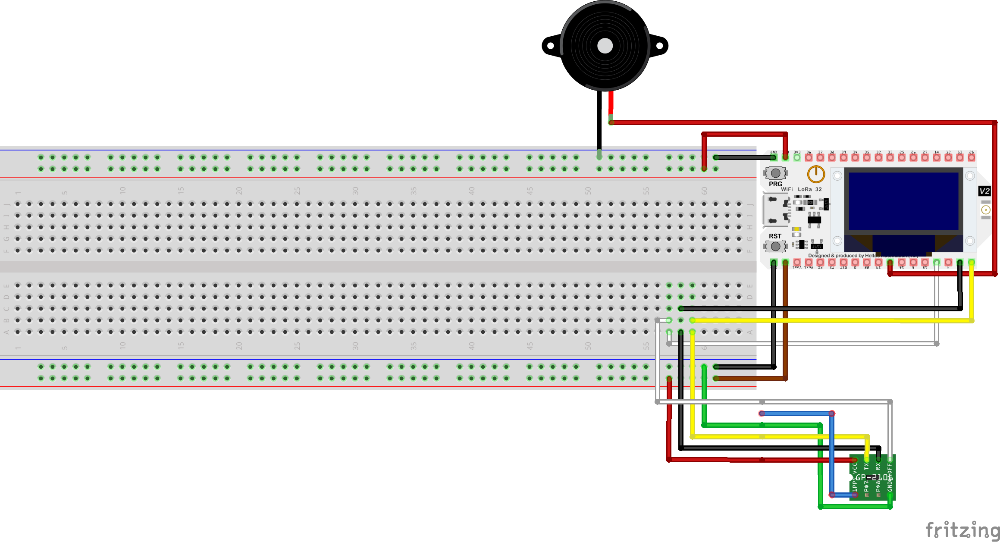
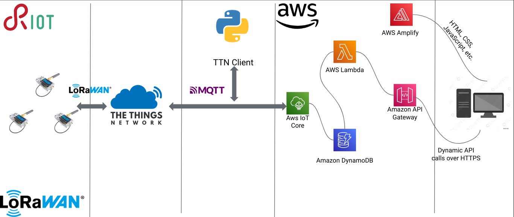

# Design

This document serves as the final design report for the project. For the previous version, please refer to [this link](https://github.com/francesco-fortunato/PaaT/blob/main/docs/Design.md).

## Conceptual Architecture

The pet tracking system architecture consists of: 
- an Heltec ESP32 LoRa WiFi board with a GPS module, battery, buzzer and LED;
- The Things Network, that acts as a gateway for communication between the ESP32 and the cloud service. It ensures seamless data transfer and enables long-range communication.
- The cloud service, a component that stores the pet's location data, performs data analysis, and generates alerts when the pet leaves the designated area. Pet owners can access the cloud service through a user-friendly web interface.

## Hardware Components

To enable effective pet tracking, monitoring and alerting, the pet tracking system incorporates the following hardware components:

1. ESP32 v2 Heltec LoRa board: The primary hardware component responsible for collecting location data from the GPS module, processing it, and transmitting it to the Things Network. 

2. GPS Module: The GPS module interfaces with the ESP32 v2 Heltec LoRa board through a serial connection (UART), providing accurate location data.

3. Buzzer: The system incorporates a buzzer that emits a loud sound to assist pet owners in locating their pets.

4. LED: An LED is integrated into the system to provide visibility during nighttime, aiding pet owners in locating their pets.

5. Battery: The battery serves as the primary power source for the ESP32 board, ensuring uninterrupted operation.

## Software Components

### Core Algorithm:

The algorithm works as follow:

#### Joining the LoRaWAN Network:

The application is using Over-The-Air Activation (OTAA).
The code sets the LoRaWAN data rate and checks if the device has already joined the network. If not, it attempts to join the network using the joinLoRaNetwork() function, a function defined since sometimes the join is not successful, which the purpose is to retry if the join fails.

#### Sending Geofence Request:

The code allocates memory for a geofence request message and constructs the JSON message using the "geofence" keyword.
The message is then sent using the semtech_loramac_send() function.

#### Receiving Geofence Data:

The code wakes up a receiver thread (_recv) to receive geofence data.
The received message is parsed and the geofence values are extracted and stored in the geofence array.

#### Geofence Violation Checking:

The code enters an infinite loop where it waits for a reliable position or a timeout.

The code checks if the number of satellites is greater than or equal to 4, and if so, determines if the current position is within the geofence using the isInGeofence() function. 

If the geofence is violated, is turned on an LED, is encrypted and sent the latitude and longitude coordinates using AES encryption, and is performed a sleep for 300 seconds.

If the geofence is not violated, it prints a message, turns off the LED, sets soundOn and lightOn flags to false, and sleeps for 300 seconds. Of course this because there is no need to know the actual position of the pet since it is inside the geofence.

### Network Protocols

#### LoRaWAN

LoRaWAN (Long Range Wide Area Network) is an industry-standard protocol specifically designed for low-power, wide-area networks. It enables long-range communication between devices while consuming minimal power. The utilization of LoRaWAN in the pet tracking system ensures that the location data from the ESP32 v2 Heltec LoRa board and GPS module can be transmitted efficiently to the cloud service.

LoRaWAN's unique properties make it exceptionally suitable for this project. It provides long-range coverage, allowing reliable communication between the pet tracking devices and the cloud service even over considerable distances. Moreover, LoRaWAN operates in the unlicensed spectrum, ensuring cost-effective deployment and scalability, instead of nowadays solutions. By employing LoRaWAN, the pet tracking system achieves extended battery life for the tracking devices while maintaining a robust and reliable network connection.

#### MQTT (Message Queuing Telemetry Transport)

MQTT is a lightweight messaging protocol designed for efficient communication between devices in IoT applications. It follows a publish-subscribe messaging pattern, where devices can publish data to specific topics, and other devices can subscribe to those topics to receive the published data.

In our project, MQTT is used to establish a seamless connection between the cloud service and the AWS IoT Core. The Things Network (TTN) stack, integrated with MQTT, enables data transmission from the pet tracking devices to AWS IoT Core.

The utilization of MQTT offers numerous advantages. It ensures efficient and reliable data transfer, even in constrained network environments. MQTT's lightweight nature minimizes network overhead and conserves energy consumption, aligning perfectly with the low-power requirements of the pet tracking system. Furthermore, MQTT's support for Quality of Service (QoS) levels enables the system to guarantee message delivery, ensuring the pet's location data reaches the AWS IoT Core without loss or compromise.

By combining LoRaWAN and MQTT, PaaT achieves a robust and efficient network infrastructure. LoRaWAN provides long-range connectivity, while MQTT facilitates seamless integration with AWS IoT Core, allowing pet owners to access real-time location data and receive timely alerts through the cloud service's web interface.

## Network Architecture

The network architecture comprises the following elements:

### IoT Devices with RIOT OS
The pet tracking system utilizes IoT devices equipped with the RIOT OS (Real-Time Operating System). These devices, such as the ESP32 v2 Heltec LoRa board, incorporate the necessary hardware components, to track and monitor pets effectively. RIOT OS provides a lightweight and efficient operating system tailored for resource-constrained IoT devices, ensuring optimal performance and low power consumption.

### The Things Network (TTN)
The Things Network plays a crucial role in the pet tracking system's network architecture. TTN serves as the LoRaWAN infrastructure provider, enabling secure and reliable communication between the IoT devices and the cloud service. It facilitates the seamless transmission of location data from the IoT devices to the cloud service, ensuring efficient data flow and connectivity.

### Python client for interfacing with TTN
To facilitate the configuration of geofence boundaries, a Python TTN client is employed. This client interacts with TTN to provide the precise coordinates of the geofence to the IoT devices. By leveraging this client, the system establishes an effective means of defining and updating the designated area in which pets should remain.

### Amazon Web Services

The pet tracking system leverages several components within the AWS ecosystem to enable data storage, processing, and web interface access. The components utilized include:

- AWS IoT Core: It serves as the central hub for communication between the pet tracking devices and the cloud service. AWS IoT Core enables secure and reliable data exchange and facilitates seamless integration with other AWS services.

- DynamoDB: This NoSQL database service is employed for storing the pet's location data. DynamoDB offers scalability, high performance, and low latency access, ensuring efficient storage and retrieval of location data.

- Lambda Functions: AWS Lambda functions are utilized to perform various operations on the pet's location data, including encryption, decryption, and data processing. These serverless functions enable real-time data manipulation and facilitate seamless integration with other AWS services.

- Amplify: AWS Amplify simplifies the development process by providing a set of tools and services for building scalable and secure web applications. It enables the creation of a user-friendly web interface for pet owners to access real-time location data and receive alerts.

- API Gateway: AWS API Gateway acts as the entry point for the web interface, providing a secure and scalable API endpoint. It enables seamless communication between the web interface and the backend services, ensuring a smooth user experience.

The user interface is reachble through this [link](https://main.d24229we7y3qnn.amplifyapp.com/)
